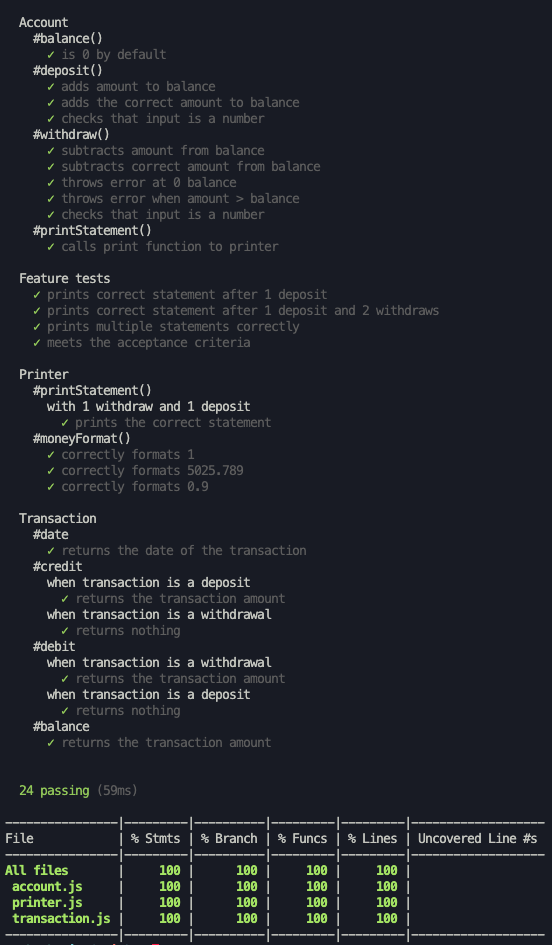
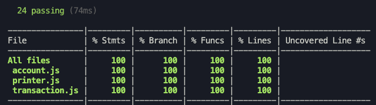
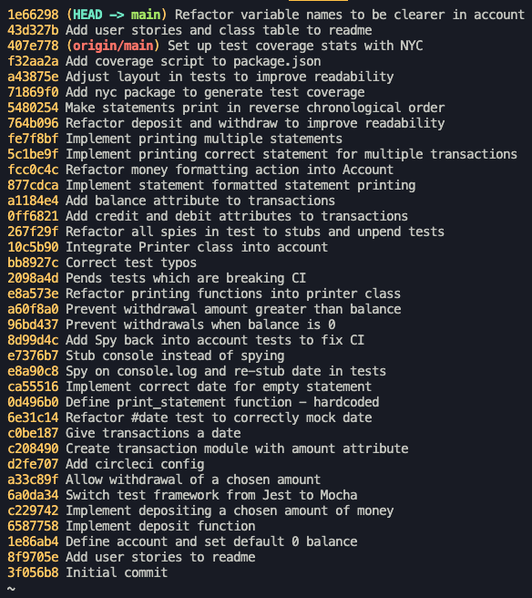
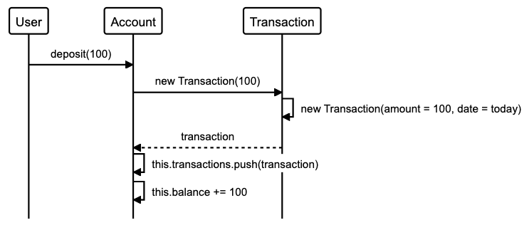
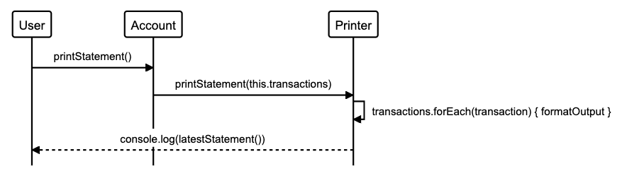

# Bank tech test

[](https://app.circleci.com/pipelines/github/AJ8GH/bank-tech-test)
[](https://app.circleci.com/pipelines/github/AJ8GH/bank-tech-test)
[](https://travis-ci.com/AJ8GH/bank-tech-test)
[](https://codecov.io/gh/AJ8GH/bank-tech-test)
[](http://standardjs.com)
[](https://codeclimate.com/github/AJ8GH/bank-tech-test/maintainability)
[](https://bettercodehub.com/)

## Getting started

### Dependencies

**_Devevelopment Dependencies:_**

- `"coveralls": "^3.1.0"`
- `"eslint": "^7.23.0"`
- `"eslint-config-standard": "^16.0.2"`
- `"eslint-plugin-import": "^2.22.1"`
- `"eslint-plugin-node": "^11.1.0"`
- `"eslint-plugin-promise": "^4.3.1"`
- `"mocha": "^8.3.2"`
- `"mocha-lcov-reporter": "^1.3.0"`
- `"mocha-sinon": "^2.1.2"`
- `"mockdate": "^3.0.5"`
- `"nyc": "^15.1.0"`
- `"sinon": "^10.0.0"`

### Installation and setup

Clone the repo, install the dependenices:

```shell
git clone git@github.com:AJ8GH/bank-tech-test.git
cd bank-tech-test
npm install
```

### Running tests

Make sure you are in the root directory: `bank-tech-test`

**_To see full test output and coverage:_**

```shell
npm test
```

**_Linting:_**

```
npm run lint .
```

### Usage

Navigate into `lib` directory, run `node` and load the `account.js` script:

_(note: you must be in the lib directory when you run node or the sub-scripts will not load, resulting in an error)_

```shell
cd lib
node
.load ./account.js
```

### Usage example

```shell
> cd lib

> node

> .load ./account.js

> account = new Account

> account.deposit(100)

> account.printStatement()
date || credit || debit || balance
07/04/2021 || £100.00 ||  || £100.00

> account.deposit(2000)

> account.printStatement()
date || credit || debit || balance
07/04/2021 || £2,000.00 ||  || £2,100.00
07/04/2021 || £100.00 ||  || £100.00

> account.withdraw(500)

> account.printStatement()
date || credit || debit || balance
07/04/2021 ||  || £500.00 || £1,600.00
07/04/2021 || £2,000.00 ||  || £2,100.00
07/04/2021 || £100.00 ||  || £100.00
```

## Test Documentation Output



## Design

### Classes

#### Account

- Understands its balance and initializes and stores its transactions
- Public functions:
  - `deposit`
  - `withdraw`
  - `printStatement`

#### Transaction

- Stores data from a specific transaction, knows the account balance, date it was created, amount and whether it was a deposit or withdrawal.
- Attributes:
  - `balance` : account balance upon completion of transaction
  - `date` : timestamp of the transaction date in `dd/mm/yyyy` format
  - `credit` : transaction amount if deposit, `undefined` if withdrawal
  - `debit` : transaction amount if withdrawal, `undefined` if deposit

#### Printer

- Understands how to format and print output to the client. Responsible for formatting and logging the transaction data into statements and converting amounts into money format.
  - public methods:
  - `printStatement`

### Approach & design

#### Testing

- TDD:
  - Emphasis on behaviour driven development
  - Automated feature tests
  - Isolated unit tests
  - Acceptance criteria met and edge cases covered
  - Red - Green - Commit - Refactor - Commit
- Test Coverage: 100% (measured using `nyc` / `istanbul`)



- Testing framework: `Mocha`
- Mocking and stubbing:
  - Date mocked with `MockDate`
  - `sinon` to stub functions in class depencies and console.log

```js
beforeEach(() => {
  account = new Account()
  mockdate.set('02/01/2021')
  sinon.stub(console, 'log')
})

afterEach(() => {
  sinon.restore()
})
```

#### Code quality

- CI: set up `circleCI` to run tests on each commit: [Circle CI project link](https://app.circleci.com/pipelines/github/AJ8GH/bank-tech-test)
- Style: repo meets `JavaScript Standard Style` guidelines - enforced using ES lint with no outstanding offences: [standardjs](https://standardjs.com/)
- Maintainability: A grade from `Code Climate` - lowest possible level of technical debt: [CodeClimate project link](https://codeclimate.com/github/AJ8GH/bank-tech-test)

#### Object Oriented Design

- Focus on Single Responsibility Principle
- Dependency injection in `account.js` to ensure code is easily extendable and mockable
- Encapsulation: 'private' functions are prefixed with an underscore

#### Git

- Atomic commits with clear messages:



#### Edge cases

The tests and system have been designed to catch the following edge cases:

- invalid inputs (anything which isn't a positive number)
- withdrawal amount > balance amount

## Extensions

With more time, it would be great to:

- Further encapsulate the `Account` logic within a `Bank` class, which could hold multiple accounts, handle user authentication etc
- Improve the format of the statement output so the table aligns correctly, to improve readability
- Design a UI to connect with the backend
- Add a database to persist data

## Specification

### Requirements

#### High-level:

- Interact via IRB or JS Console
- Data kept in memory (no database)

#### User functionality:

- Deposits
- withdrawals
- Account statement printing (date, amount, balance)

### Acceptance criteria

**Given** a client makes a deposit of 1000 on 10-01-2012
**And** a deposit of 2000 on 13-01-2012
**And** a withdrawal of 500 on 14-01-2012
**When** she prints her bank statement
**Then** she would see

```
date || credit || debit || balance
14/01/2012 || || 500.00 || 2500.00
13/01/2012 || 2000.00 || || 3000.00
10/01/2012 || 1000.00 || || 1000.00
```

**_table format_**

| date       | credit  | debit  | balance |
| ---------- | ------- | ------ | ------- |
| 14/01/2012 |         | 500.00 | 2500.00 |
| 13/01/2012 | 2000.00 |        | 3000.00 |
| 10/01/2012 | 1000.00 |        | 1000.00 |

## Planning

### User stories

```
As a client,
I want to be able to make a deposit,
So that I can keep my money safe.

As a client,
I want to be able to make a withdrawal,
So that I can access my money.

As a client,
I want to be able to request bank-statements,
So that I can keep track of my banking activities.

As a client,
I want statements to show the transaction amount, type, date and new balance,
So that I can be fully informed.

As a client,
I want transactions listed with the most recent first.
For convenience and a better UX.

As a Bank Manager,
I want accounts to prevent withdrawals into negative balances,
So that the bank does not lose money and clients don't get into debt.
```

### Classes

| Object      | Message          |
| ----------- | ---------------- |
| Account     | deposit()        |
| Account     | withdraw()       |
| Account     | printStatement() |
| Transaction | date             |
| Transaction | credit           |
| Transaction | debit            |
| Transaction | balance          |
| Printer     | printStatement   |
| Printer     | moneyFormat()    |

### Diagrams

**_Deposit Sequence_**



**_Print Statement Sequence_**


